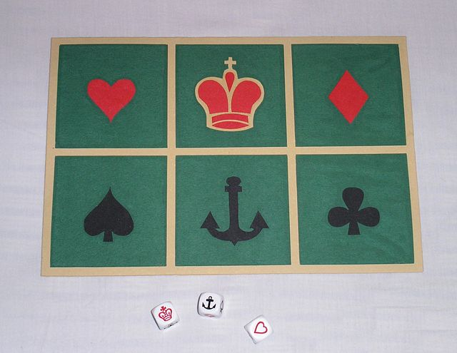
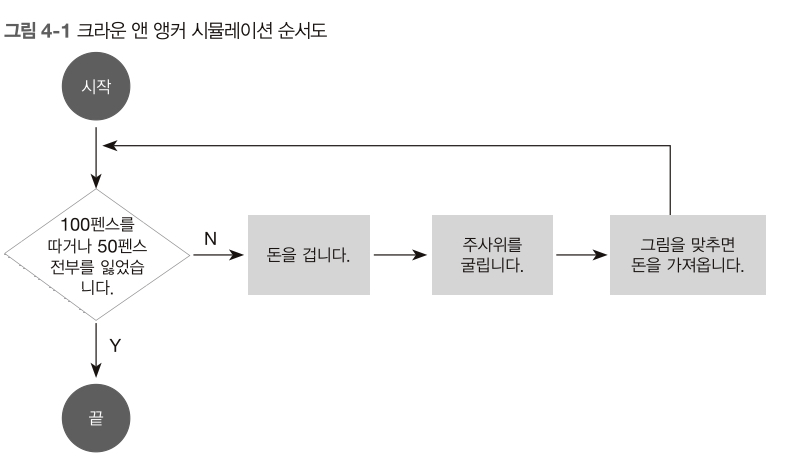

# 제어문


---


## 제어문의 기초
주사위 게임 크라운 앤 앵커(Crown and Anchor)를 제어문으로 구현해 보자



게임은 평평한 면 위에 여섯 개의 사각형이 있고, 각 사각형에는 크라운, 앵커, 하트, 클럽, 스페이드, 다이아몬드를 나타내는 그림이 있다. 게임을 하는 선원은 그 사각형에 마음대로 돈을 걸 수 있다. 돈을 건 다음에는 (평면에 있는 사각형 숫자와 일치하는) 6면체 주사위 세 개를 굴린다. 주사위가 사각형 번호에 일치하는 숫자에 멈추면, 선원은 건 만큼의 돈을 따게 된다. 

예를 들어 크라운에 5 펜스를 걸었는데, 주사위 3번이 모두 크라운이 나오면 15 펜스를 얻는다. 만약 3번의 주사위 결과가 크라운, 하트, 스페이드라면 5펜스만 얻는다.

게임을 위한 기본 조건을 만든다.(시작 조건과 끝 조건) 토마스는 크라운 앤 앵커 게임을 하기 위해 50 펜스를 준비했다. 운이 좋아서 100 펜스를 번다면 즐겁게 게임을 마칠 것이다. 하지만 그 전까지는 전부 잃지 않는 이상 계속 게임을 진행할 것이다.



위는 토마스가 어떻게 행동할지를 그린 시뮬레이션 순서도다. 마름모는 예/아니오 결정이며, 사각형은 행동을 나타낸다. 우리는 이 순서도를 컴퓨터가 이해하도록 설계해야 한다.

* 변수 할당: funds = 50, bets = {}, hand = []
* m 이상, n 이하의 무작위 정수: rand(1, 6)
* 하트, 크라운 등을 결정한 무작위 문자열 randFace()

* 객체 프로퍼티 할당: bets["heart"] = 5, bets[randFace()] = 5
* 배열에 요소 추가: hand.push(randFace())
* 간단한 사칙연산: funds - totalBet, funds + winnings
* 증가: roll++

순서도의 결정 부분(마름모)는 다음과 같이 제한한다.

* 숫자 비교: funds > 0, funds < 100
* 일치 비교: totalBet === 7
* 논리 연산자: funds > 0 && funds > 100


---


### while 루프

```JavaScript
let funds = 50;    // 시작 조건

while(funds > 1 && funds < 100) {
    // 돈을 건다

    // 주사위를 굴린다.

    // 맞췄다면 돈을 가져온다.
}

```